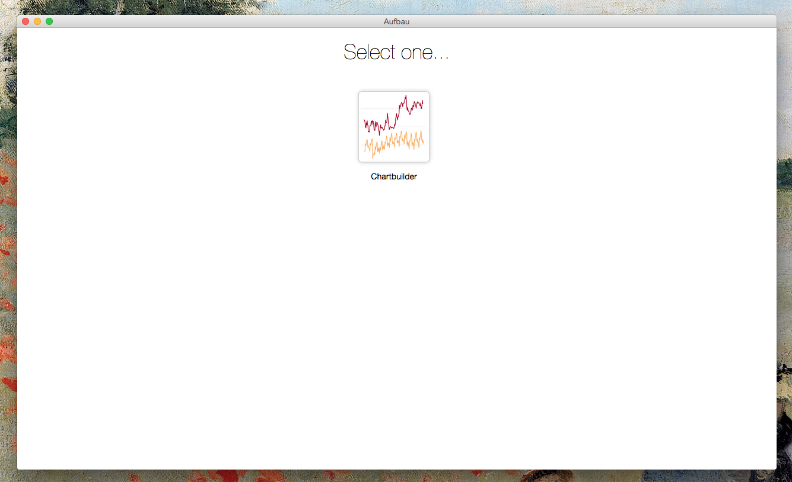

Aufbau
======

> A desktop app to view and use a hand-curated, artisanal selection of local web apps.



## What's it for?

This project is aimed at creating a modular collection of tools that you run from a single desktop application. 

## Configuration

Change the name of `apps.sample.json` to `apps.json` and fill out the information for your app. Here's a sample json object for Chartbuilder

````js
[
  {
    "package": {
      "chartbuilder": "^2.0.0" // Package name and version number, see below for projects that aren't on npm
    },
    "displayName": "Chartbuilder", // How you want it to display
    "indexPath": "build/index.html", // The path to the `index.html` entry point for your app
    "buildCmd": "npm run build", // Optional, any additional build command 
    "icon": "chartbuilder.png" // Optional, specify an icon here and add it to the `icons/` folder if the app doesn't come with one.
  }
]
````

**Note:** Only one build command is supported. That is to say, you can't do something like `gulp && npm run build`. If you have a command like that, simply make a new `script` command that runs those two together.

You can also include private or public GitHub repos with the following syntax

````js
[
  {
    "package": {
      "aufbau-files": "mhkeller/aufbau-files"
    },
    "displayName": "Files",
    "indexPath": "src/index.html",
    "buildCmd": "npm run build"
  }
]
````

### Development

```bash
$ npm install
$ npm start
```

### Install apps

After you've added a new app to `apps.json` that has a build process, run the following:

````bash
$ npm run install-apps
````

This will add each app to your `node_modules` folder by running `npm install`. It will also execute any specified build commands specified in `apps.json`.

**Note:** This command is run after you run `npm install` on Aufbau, or before any time you build out the desktop app with `npm run build`.

### Build the desktop app

```
$ npm run build
```

Builds the app for OS X, Linux, and Windows, using [electron-packager](https://github.com/maxogden/electron-packager).

## Creating Aufbau apps

Check out [Aufbau files](http://github.com/mhkeller/aufbau-files) for a simple example. The biggest difference between writing normal web apps is that your JavaScript is executed in a CommonJs environment, which means you can use node module syntax to delcare your dependencies. You also have read / write access to the filesystem. 

By default, the Aufbau install process adds [a home button link](/home-button.html) if one doesn't exist already. If you include an element with id `AUFBAU-home`, you can include your own markup and styles. If you just want to change the style, any CSS rules targeted to `#AUFBAU-home` will override existing styles, since default declarations are to the *class* `.AUFBAU-home`.

Add your application's icon in an `assets/` folder and name it `icon.png`. It should be roughly 254x254.

## What's `Aufbau` mean?

`Aufbau` means "to build up" in German. The [Aufbau principle](https://en.wikipedia.org/wiki/Aufbau_principle) is the process by which electrons fill orbital levels around an atom's nucleus. Because this app is about building a collection of [Electron](http://github.com/atom/electron) apps, it seemed appropriate.

## License

MIT © [mhkeller](http://github.com/mhkeller/aufbau)
