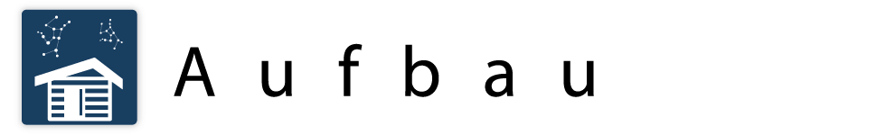
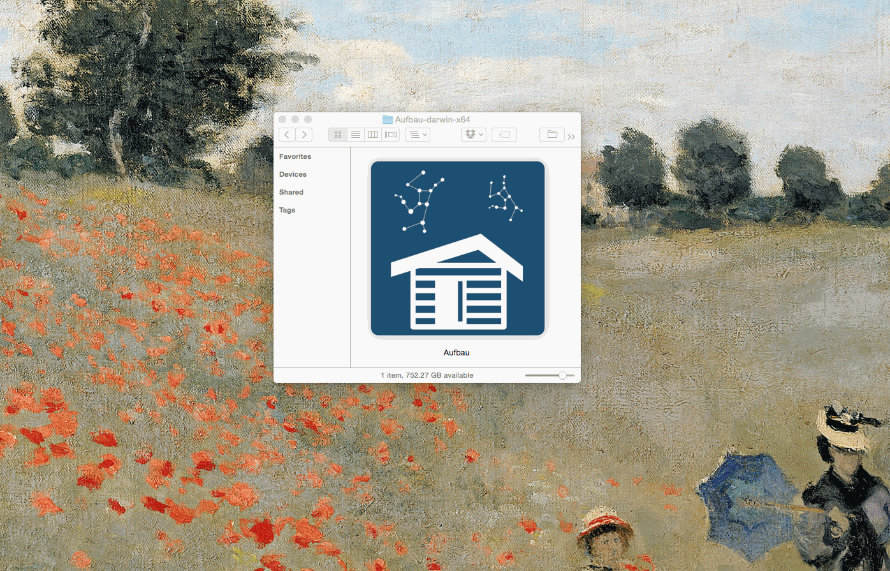

> A desktop app to view and use a hand-curated, artisanal selection of local web apps.



## What's it for?

This project is a way to have a single desktop application that's the home for all your tools. It's designed to be modular so that you can include simple web apps within this desktop interface, even if they were never designed for that context. Or, if you want to design one specifically for Aufbau, you can include that as well. 

## Configuration

Your installed apps are defined in an `apps.json` file. Rename `apps.sample.json` to `apps.json` to get started. 

Add an object to this list for it to appear in your Aufbau dashboard. Here's a sample json object for Chartbuilder

````js
[
  {
    "package": {
      "chartbuilder": "^2.0.0" // Package name and version number, see below for projects that aren't on npm
    },
    "displayName": "Chartbuilder", // How you want it to display
    "indexPath": "build/index.html", // The path to the `index.html` entry point for your app
    "buildCmd": "npm run build", // Optional, any additional build command 
    "icon": "chartbuilder.png" // Optional, only needed if your app doesn't have its own icon in `icons/icon.png`. The icon specified here live in the aufbauf `icons/` folder.
  }
]
````

**Note:** Only one build command is supported. That is to say, you can't do something like `gulp && npm run build`. If you have a command like that, simply make a new `script` command in you `package.json` that runs those two together. If your app is more complicated, see below.

You can also include **private** or **public** GitHub repos with the following syntax:

````js
[
  {
    "package": {
      "aufbau-files": "mhkeller/aufbau-files"
    },
    "displayName": "Files",
    "indexPath": "src/index.html",
    "buildCmd": "npm run build"
  }
]
````

[Aufbau files](http://github.com/mhkeller/aufbau-files) is a simple modular for downloading files — useful for admin documents.

##### Apps with more complicated build processes

If your app build process is more involved, maybe it's bilingual and needs a virtualenv for other dependencies, you can drop your app in the `www/node_modules/` folder and build it manually. The app still needs an `apps.json` definition and you can tell it to skip the installation processes by putting `skip-install` in lieu of the version number. When you run `npm run install-apps`, it will still add the home button, if that doesn't already exist.

````js
[
  {
    "package": {
      "my-complex-app": "skip-install"
    },
    "displayName": "Web of intrigue",
    "indexPath": "build/index.html",
    "icon": "my-app-icon.png" // Only needed if not included in your app.
  }
]
````

### Make your own version

#### Step 1: Dry-run

The first step toward customization is to add the apps you want to `apps.json`. The sample `apps.json` comes with two already, though, so just to make sure everything is working. Run the following:

```bash
$ npm install
$ npm start
```
That should launch a window with a simple two-app dashboard. To exit, press <kbd>ctrl+c</kbd> in the console window or close the Electron app.

In your console output during installation, you'll have seen a bunch of information about installing apps, building apps, pruning apps and adding home buttons. We'll explain that in a little bit. In short, Aufbau is taking the app definitions in `apps.json`, downloading them and installing them into the desktop environment.

#### Step 2: Add your own apps

Using the rubrique above, add your own app definitions to `apps.json`. When you're done, run the following:

````bash
$ npm run install-apps
````

This will install each app to the `www/node_modules` folder by running `npm install`. It will also execute any specified build commands specified in `apps.json`.

**Note:** `npm run install-apps` is run after you run `npm install` on Aufbau (like we did above).

#### Step 3: Testing locally

To see if that worked, now launch the desktop app preview with the following like we did before. Again, to exit, press <kbd>ctrl+c</kbd> in the console window or close the Electron app.

````
$ npm start
````

#### Step 4: Building the desktop app

If all that looks good, you'll want to bake out a desktop app for all to use! To do that, run the following, which will add the double-click desktop applications to the `aufbau-dist/` folder.

```
$ npm run build
```

This will build applications for OS X, Linux, and Windows, using [electron-packager](https://github.com/maxogden/electron-packager). 

#### Bonus step: Customizing the name and icon

If you'd like to change the name of the desktop app, change the [`productName`](/package.json#L3) in `package.json` as well as where you see `Aufbau` [right after](package.json#L19) `electron-packager` also in `package.json` near line 19. One last place is in [`index.js`](index.js#L16) near line 16 where it says `title`, which is what displays in the toolbar.

You can also change the icon by replacing the `main.icns` file in the `assets/` folder. The file must be in `icns` format. Here's a [handy converter](https://iconverticons.com/online/) if you have a `png` or other image format.

## Creating Aufbau app modules

Check out [Aufbau files](http://github.com/mhkeller/aufbau-files) for a simple example. 

The biggest difference between writing normal web apps is that your JavaScript is executed in a CommonJs environment, which means you can use node module syntax to delcare your dependencies, which gives read / write access to the filesystem. That is purely optional, however; you can write your modules just the same you would for any normal browser-based project.

By default, the Aufbau install process adds [a home button link](/home-button.html) if one doesn't exist already. If you include an element with id `AUFBAU-home`, you can include your own markup and styles. If you just want to change the style, any CSS rules targeted to `#AUFBAU-home` will override existing styles, since default declarations are to the *class* `.AUFBAU-home`.

#### Setting your module's icon

Your module's icon should be roughly 254x254 and you can put it in one of two places:

1. It can be packaged with your app in the `icons/` folder and named `icon.png`.
2. You can set a `icon` value in the module's `apps.json` delcaration and put a corresponding image in the `icons/` folder in Aufbau. This is how we do for Chartbuilder — it wasn't designed to be run in a desktop environment so it has no icon and we must declare it on Aufbau's end.

## What's `Aufbau` mean?

`Aufbau` means "to build up" in German. The [Aufbau principle](https://en.wikipedia.org/wiki/Aufbau_principle) is the process by which electrons fill orbital levels around an atom's nucleus. Because this app is about building a collection of [Electron](http://github.com/atom/electron) apps, it seemed appropriate.

## License

MIT © [mhkeller](http://github.com/mhkeller/aufbau)

Cabin image by [Ana María Lora Macias](https://thenounproject.com/search/?q=log%20cabin&i=13415)
